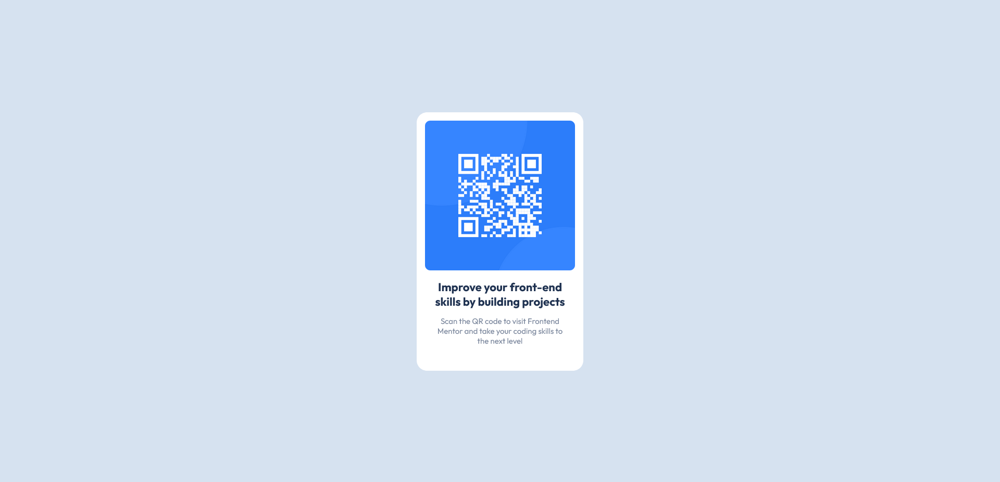

# Frontend Mentor - QR code component solution

This is a solution to the [QR code component challenge on Frontend Mentor](https://www.frontendmentor.io/challenges/qr-code-component-iux_sIO_H). Frontend Mentor challenges help you improve your coding skills by building realistic projects. 

## Table of contents

- [Overview](#overview)
  - [Screenshot](#screenshot)
  - [Links](#links)
- [My process](#my-process)
  - [Built with](#built-with)
  - [What I learned](#what-i-learned)
  - [Continued development](#continued-development)
  - [Useful resources](#useful-resources)
- [Author](#author)

**Note: Delete this note and update the table of contents based on what sections you keep.**

## Overview

### Screenshot



### Links

- Solution URL: (https://github.com/BuluBerry/Qr-code-component)
- Live Site URL: (https://buluberry.github.io/Qr-code-component/)

## My process

### Built with

- HTML5
- CSS3

### What I learned

It's been a few months since i've done any coding, so this was just a great project to get my brain working again. I'm not too familiar with "transform" so I had to do a bit of problem solving to get the conainer in the exact center of the screen. 

```css
.container{
    width: 320px;
    height: 497px;
    background-color: white;
    position: fixed;
    top: 50%;
    left: 50%;
    transform: translate(-50%, -50%);
    text-align: center;
    border-radius: 20px;
}
```

### Continued development

I need to work on easily moving stuff around the screen to the exact location I want them, either using "transfom", "flex", or "grid". 

### Useful resources

- stack Overflow [https://stackoverflow.com/] is one of my favorite places to go if I need to trouble shoot a problem, or if I just can't figures out what I need to add. 

## Author

- Frontend Mentor - [@BuluBerry](https://www.frontendmentor.io/profile/BuluBerry)
